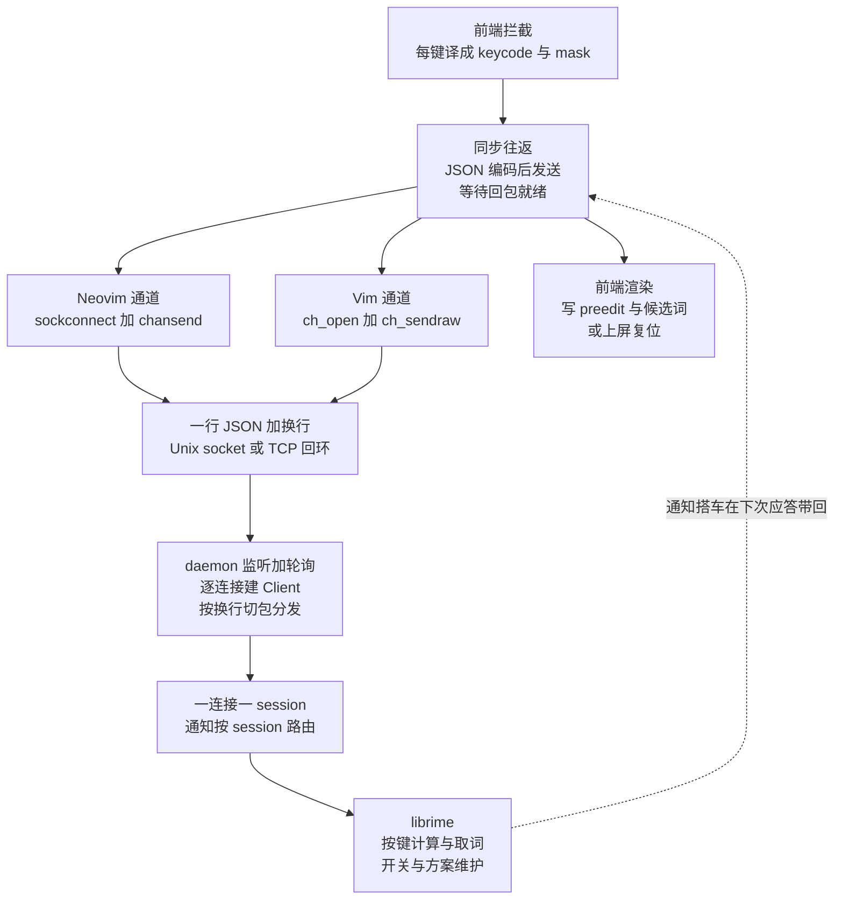
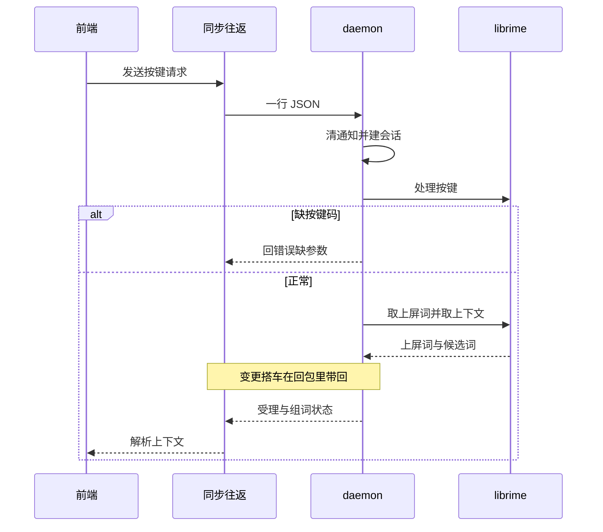
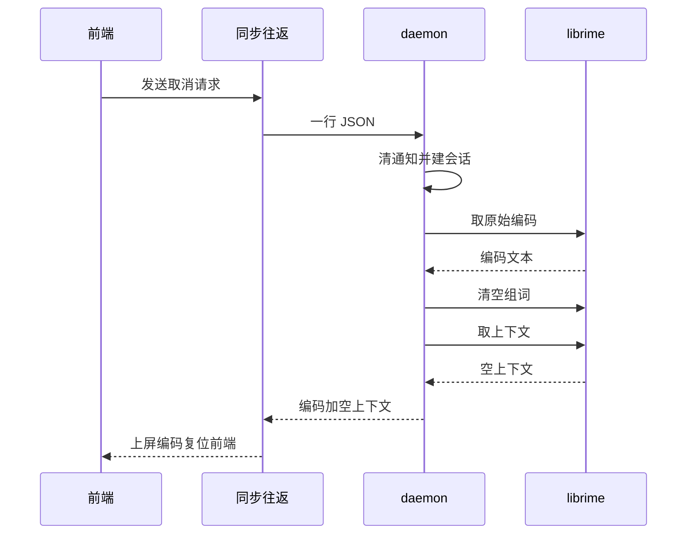
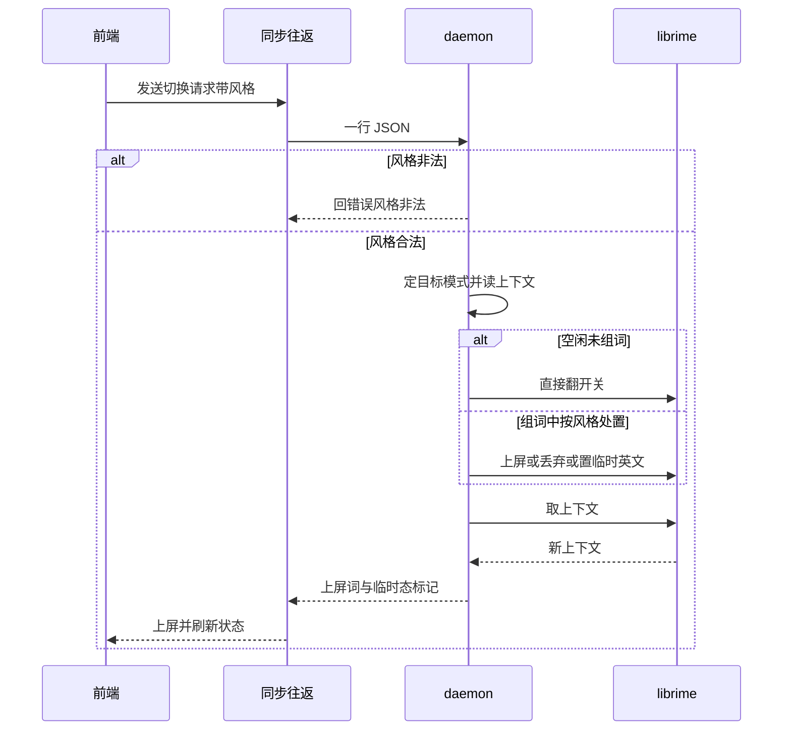
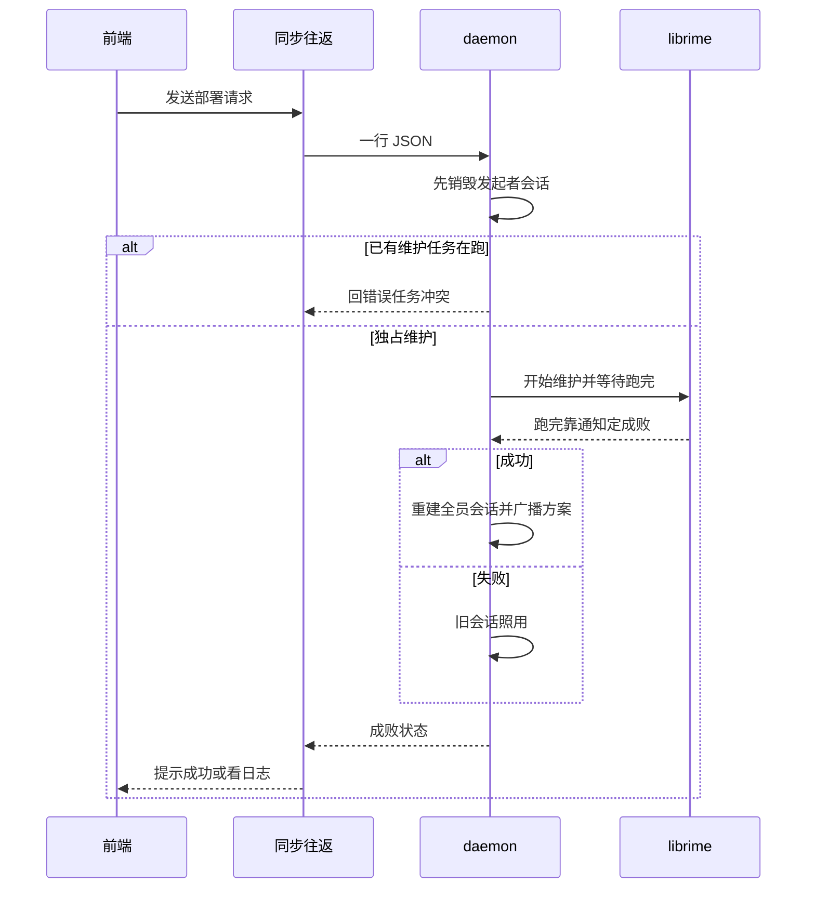
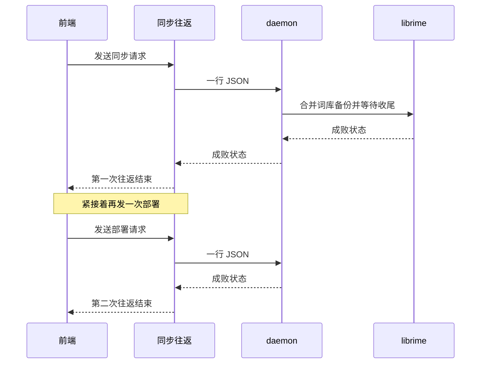
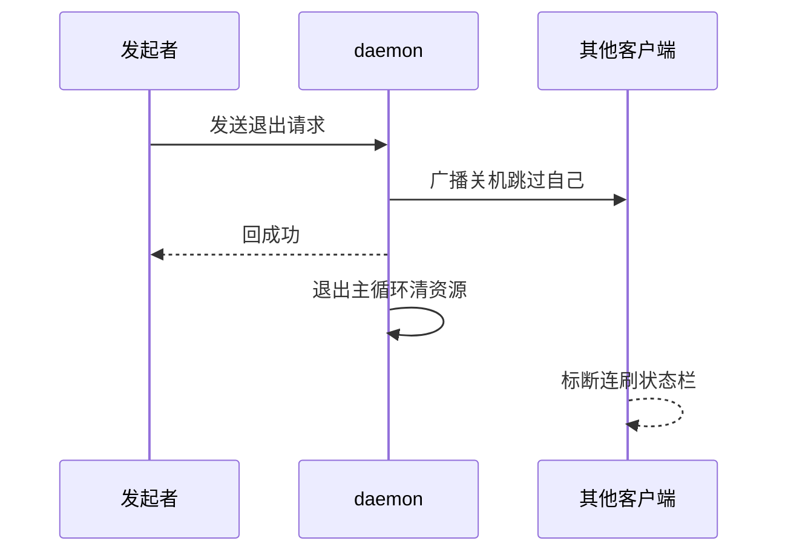
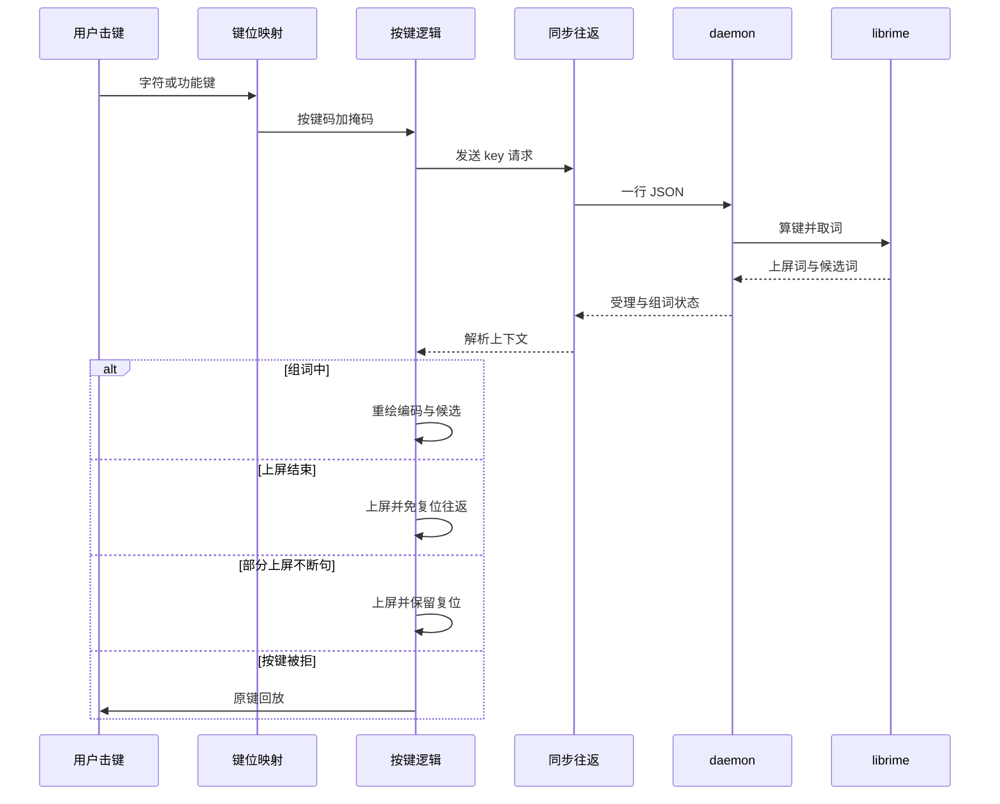

# 通信架构

本文描述 `rime-query` 后端 daemon 与 Vim / Neovim 前端之间的一行 JSON 行协议、
请求类型与关键时序。实现位置：后端 `cpp/rime-query.cc`，前端 `autoload/im/rime.vim`
与 `autoload/im.vim`。

## 总览



核心只有三段：前端把按键译成 keycode/mask 发出去，后端调 librime 算出
commit/preedit/候选词回包，前端负责渲染（`setline` 写 preedit、`complete()`
弹候选、`matchaddpos` 画下划线）或上屏。

## 传输对照

| 平台          | 编辑器 | 默认传输  | 自定义端点                                  |
| ------------- | ------ | --------- | ------------------------------------------- |
| macOS / Linux | Neovim | Unix socket | `g:im_unix_socket`                        |
| macOS / Linux | Vim    | Unix socket | `g:im_unix_socket`                        |
| Windows       | Neovim | TCP 回环    | `g:im_tcp_addr` / 环境变量 `RIME_QUERY_TCP` |
| Windows       | Vim    | TCP 回环    | `g:im_tcp_addr` / 环境变量 `RIME_QUERY_TCP` |

Unix socket 默认取 `$XDG_RUNTIME_DIR/rime-query.sock`，否则
`~/.cache/rime-query.sock`；Windows 默认 `127.0.0.1:18666`。
请求为 `{id, type, ...}`，应答为 `{id, ok, ...}`，前端用自增 `pending_id`
配对回包，迟到的旧包（含 daemon 的 `id=0` 就绪广播）直接丢弃。

## 请求类型

| type | 前端调用 | 后端动作 | 说明 |
| ---- | -------- | -------- | ---- |
| `ping` | 建连握手 | 记录 `app`，回 `ok` | 存活探测 |
| `warmup` | 启动后 1 次 | `process_key('a')` 再 `clear` | 预热首键懒加载 |
| `key` | 每键（800ms 超时） | `process_key` + 取 commit + 取 context | 打字热路径（含数字选词，由 librime 按上下文解释） |
| `cancel` | Esc（800ms） | 取原始编码 + `clear_composition` 一次完成 | 2 RTT 合 1 |
| `switch_ascii_mode` | `;,` 等切换 | 6 种 style 分支（含临时英文态） | 详见定制中英切换 |
| `reset` | 组合结束（100ms） | `clear_composition` | 后端已干净时前端直接跳过 |
| `get_option` | 保留接口 | `get_option` | 已被 `get_options` 合并，不再使用 |
| `get_options` | 启动 `state#init`（800ms） | 批量查 | 4 RTT 合 1，需新版 daemon |
| `get_schema` | 启动 `state#init`（800ms） | `get_current_schema` + 枚举 `get_schema_list` 配名字 | 初始方案名显式拉取，`deploy`/`sync` 后经 `init` 重拉，需新版 daemon |
| `set_option` / `toggle_option` | `;a` / `;f` / `;e` 等 | `set_option` | 800ms / 300ms 超时 |
| `deploy` / `sync` | `:IMDeploy` / `:IMSync` | 独占跑完整维护，重建全部 session（前端随后重拉方案） | 阻塞，60s 超时 |
| `quit` | `:IMShutdown` | 向其他客户端广播 `shutdown` 后退出 | 多实例协同退出 |

## 请求详解

约定：所有请求都带 `id`（前端自增，后端原样带回，前端靠它配对）；所有回包都有 `id` + `ok`。
`ok:false` 的回包前端视为 `v:null`（走重连或降级），见下各节。超时时间为前端等待上限。

### `ping`

| 项 | 内容 |
| --- | --- |
| 前端调用 | 建连握手（`im_handshake_timeout_ms`，默认 800ms） |
| 请求字段 | `app`（`vim` / `nvim`，后端记日志用） |
| 回包字段 | `ok` |
| 后端动作 | 无（不碰 session） |
| 说明 | 存活探测也复用它；Windows 下探活已有实例同样先发一次 `ping` |

### `warmup`

| 项 | 内容 |
| --- | --- |
| 前端调用 | `RimeIMReady` 前（`set_initial_options()` 之后，800ms，回包直接丢弃；仅复用已存活连接路径，新建/轮询建连不跑） |
| 请求字段 | 无 |
| 回包字段 | `ok` |
| 后端动作 | `process_key('a')` 再 `clear_composition` 空转一次，逼 librime 走完首键懒加载（刷词典、起 Lua），之后真打字不卡 |

### `key`

打字热路径，前端 `im#rime#key()`（800ms），由 `im#key` 在每次按键时调用。

| 项 | 内容 |
| --- | --- |
| 请求字段 | `keycode`（缺失直接 `ok:false` + `"key requires 'keycode'"`）、`mask`（Shift/Ctrl/Release 位） |
| 回包字段 | `accepted`（librime 是否收下）、`committed`（本次上屏词）、`preedit`、`input`（无）、`cursor_pos`、`sel_start`、`sel_end`、`candidates[]`、`comments[]`（与 candidates 一一对应）、`page_no`、`highlighted_candidate_index`、`has_more`（是否还有下一页）、`composing`（preedit 是否非空）、`changed_options[]`、`schema_changed`、`schema_id` / `schema_name`（仅变更时带） |
| 后端顺序 | `clear_key_notifications` → `ensure_session` → `process_key` → `fetch_commit`（取走制，紧跟动作，顺序错了丢上屏词）→ `fill_context` → `finish_inline_ascii` → `fill_notifications` |
| 说明 | 数字选词也走这里，由 librime 按上下文把数字解释为选词，无独立通道 |



### `cancel`

Esc 路径，前端 `im#rime#cancel()`（800ms），由插入模式的 `im#cancel_composition()` 调用。

| 项 | 内容 |
| --- | --- |
| 请求字段 | 无 |
| 回包字段 | `input`（组词中的原始编码）+ 同 `key` 的上下文与通知字段 |
| 后端顺序 | `clear_key_notifications` → 取 `input` → `clear_composition` → `fill_context` → `finish_inline_ascii` → `fill_notifications` |
| 说明 | 一次顶旧的 `get_input` + `reset` 两次；`input` 为空说明本来就没在组词 |



### `switch_ascii_mode`

中英切换，前端 `im#rime#switch_ascii_mode(style)`（800ms），由 `im#ascii_switch` 调用。

| 项 | 内容 |
| --- | --- |
| 请求字段 | `style`，6 种之外的直接 `ok:false` + `"invalid style: ..."` |
| 回包字段 | `style`（回显）、`committed`（切换带出的上屏）、`inline_ascii`（是否进入临时英文态）+ 上下文与通知字段 |
| 组词中按 style 处置 | `commit_code`：编码原样上屏（有候选也不要）；`commit_text`：有候选上屏高亮项（内部调一次选词），无候选回落到编码；`clear` / `set_ascii_mode` / `unset_ascii_mode`：直接丢弃组词；`inline_ascii`：置临时英文态，本次上屏完由 `finish_inline_ascii` 自动切回中文 |
| 说明 | 空闲切换只翻 `ascii_mode` 开关；显式切回中文会同步灭 `inline_ascii_active`，防重复 option 通知 |



### `reset`

| 项 | 内容 |
| --- | --- |
| 前端调用 | `im#rime#reset()`（100ms，超时最短的一个），由组词结束的清理路径调用 |
| 请求字段 | 无 |
| 回包字段 | `ok` + 上下文与通知字段（此时一般为空） |
| 后端动作 | `clear_key_notifications` → `clear_composition` → 后半套 |
| 说明 | 后端已干净（`composing==false`）时前端直接跳过不发，只调 `reset_frontend()`（免后端分支） |

### `get_option` / `get_options`

| 项 | 内容 |
| --- | --- |
| 前端调用 | 单查保留给集成测试直调；批量由 `state#init` 调用（800ms） |
| 请求字段 | 单查：`option`（为空 `ok:false`）；批量：`options[]`（非数组 `ok:false` + `"options(array) is required"`） |
| 回包字段 | 单查：`option` + `value`；批量：`values` 对象（名→布尔，一次取回 4 个开关，1 RTT 顶 4 次） |
| 说明 | 批量是启动优化；单查前端业务已不用，仅测试与排障保留 |

### `get_schema`

| 项 | 内容 |
| --- | --- |
| 前端调用 | `state#init` 调用（800ms），`on_ready` / `deploy` / `sync` 后各 1 次 |
| 请求字段 | 无（`ensure_session` 隐式建会话） |
| 回包字段 | `schema_id` + `schema_name`（`name` 枚举不到时为空串，前端用 `id` 兜底） |
| 后端动作 | `ensure_session` → `get_current_schema` 取 `id` → 枚举 `get_schema_list` 按 `id` 配 `name` |
| 错误 | 建不出 session 或无当前方案时 `ok:false` |
| 说明 | 替代已删除的 `schema_broadcast` 搭车；中途切方案仍走 `schema_changed` 推送 |

### `set_option` / `toggle_option`

| 项 | 内容 |
| --- | --- |
| 前端调用 | `im#rime#toggle_*`（300ms）/ `im#rime#set_option`（800ms），对应 `;a` / `;f` / `;e` 等开关 |
| 请求字段 | `option`（为空直接 `ok:false`）；`set_option` 另带 `value`（缺省按 false） |
| 回包字段 | `ok`、`option`（回显）、`value`（执行后的实际值，前端直接落状态栏） |
| 后端动作 | 读当前值（toggle 则翻转）→ `set_option` → 若动的是 `ascii_mode` 且新值为关，同步灭 `inline_ascii_active`（与 switch 分支同理，防状态漂移） |
| 错误 | `option` 为空或建不出 session 时 `ok:false` |

### `deploy`

| 项 | 内容 |
| --- | --- |
| 前端调用 | `im#rime#deploy()`（`:IMDeploy`，`g:im_deploy_timeout` 默认 60s） |
| 请求字段 | 无 |
| 回包字段 | `ok`、`deploy_status`（成功/失败），失败时另带 `error` |
| 后端顺序 | 先销毁**发起者**自己的 session（维护期间旧 session 非法）→ `start_maintenance(true)` → `join` 等跑完（成败靠 `deploy` 通知回写的全局状态判定，收不到通知视为成功）→ 成功才 `rebuild_all_client_sessions()`（全员重建 + 方案广播），失败则旧 session 照用 |
| 错误 | 已有维护任务在跑时直接 `ok:false` + `"maintenance already in progress"` |



### `sync`

| 项 | 内容 |
| --- | --- |
| 前端调用 | `im#rime#sync()`（`:IMSync`，同 60s 超时）；**注意 Vim 侧发完 `sync` 还会再发一次 `deploy`**，所以一次 `:IMSync` 是两次后端往返 |
| 请求字段 | 无 |
| 回包字段 | 同 `deploy`（`deploy_status` / `error`） |
| 后端动作 | `sync_user_data()`（双向合并 `sync/<installation_id>/` 下的用户词库备份）+ `join` 等收尾；必须等完，否则最后导出 `*.userdb.txt` 的步骤会被打断 |
| 说明 | 与 `deploy` 不同：`sync` 不重建 session，只返回成败，真正的重部署靠随后那次 `deploy` |



### `quit`

| 项 | 内容 |
| --- | --- |
| 前端调用 | `im#rime#shutdown()`（`:IMShutdown`，800ms） |
| 请求字段 | 无 |
| 回包字段 | `ok`（只回给发起者） |
| 后端动作 | 向**除发起者外**的全员广播 `{id:0, ok:true, type:"shutdown"}`，然后 `g_should_exit=1`，主循环退出、删 socket、释放 librime |
| 说明 | 前端收到广播走 `daemon_died`（标断连、刷状态栏），`timer` defer 避免 channel 回调重入 |



## 关键时序

### 击键（`im#keymap#char → im#key`）



### 取消（Esc）

```txt
im#cancel_composition → {type: cancel} 取原始编码并清后端（1 RTT，需新版 daemon）
  → 上屏原始编码 → reset_frontend() 只清前端
```

### 启动

```txt
IMStart → 连已有 daemon 或拉起新进程 → 50ms 轮询建连
  → ping 握手 → RimeIMReady → on_ready
  → get_options 一次取回 4 个开关
（推初始开关 + warmup 只在复用已存活连接时跑在 RimeIMReady 之前；
  新建连接与轮询建连路径跳过，冷启动不预热）
```

## 通知搭车

librime 的 `option` / `schema` / `deploy` 回调是异步的，后端按 session
攒进各 `Client`（`changed_options` / `schema_changed` + `schema_id/name`），随**下一次**
正常应答带回，前端在 `im#state#sync_notifications` 里落状态并刷新状态栏。
初始方案名不走搭车：`ensure_session` 只建会话，前端 `state#init` 调 `get_schema`
显式拉一次（`deploy`/`sync` 重建会话后同样经 `init` 重拉）；之后中途切方案
只走增量通知，不再每键查询。

## 多实例

daemon 单例（socket 抢占 / TCP 端口抢占保证同一端点只有一个），每个编辑器
连接独占一个 Rime session；最后一个客户端离开后按 `--idle-exit-ms`
（默认 60s，`0` 常驻）退出；词库学习通过 `:IMSync` 的 userdb 双向合并跨
实例共享。
